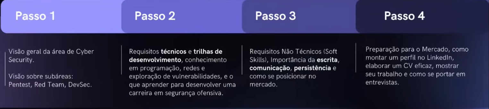

# Como melhorar e ingressar no mercado de Cyber Segurança   
## Introdução
Como é de se esperar, o mercado relacionado a Cyber Segurança vem se expandindo bastante, principalmente com o avanço das Inteligẽncias Artificiais e os famosos *vibecoders*.
Com tudo isso, acabou surgindo a demanda crescente por profissionais da área e Segurança Cibernética. Mas, há um problema relacionado a essa demanda: **A falta de profissionais competentes e preparados**.
Não adianta termos uma demanda absurda por profissionais desa área sendo que não temos profissionais capacitados para isso.

## O que o mercado pede
Estamos falando de um ambiente competitivo, ou seja, **não existe espaço para amadores**, e por conta disso devemos sempre buscar melhorar e aprimorar nossas habilidades.

## Iniciando
Quando decidimos entrar nesse mercado, é necessário defirmos algumas coisas, sendo elas:
- Qual área/ramo se especializar
- Não tente ser especialista em tudo de uma vez, foque em uma coisa/área por vez

## As 3 travas que impedem o progresso
### Trava 1 - Lacuna Educacional
Falta de conhecimento essenciais básicos, como:
- Redes
- Sistemas Operacionais
- Programação

**Solução**: Criação de uma base sólida, de acordo com a área que você deseja seguir

### Trava 2 - Obesidade mental
Da mesma forma que temos quem não tem conhecimento algum, existe também quem apenas "consome" conteúdo e não aplica, ou seja, acumula muita **informação** e pouco **conhecimento**.

> **Informação** é a **base** do **conhecimento**, ou seja, a informações é cumulativa, enquanto o conhecimento é seletivo. - Cortella

conhecimento = ententer a informação + aplicar a informação

**Solução**: Não só estudar, mais aplicar e entender o conteúdo estudado

### Trava 3 - Falta de Direção
Você quer aprender tudo: Pentest Web, Cloud, Pentest Infra/AD, Mobile, Bug Bounty, Malware...
>Enquanto você tenta aprender tudo, não domina nada.

Querendo ou não, você vai ter **algum conhecimento** nas mais diversas áreas dentro do mundo de Cyber Segurança, mas mesmo assim você precisa **focar em apenas uma delas por vez**. 

**Solução**: Ter um mapa/planejamento

## O tempo é implacável
Quem não respeita o tempo das coisas é brutalmente ceifado
Seja intencional
> Calma é precisão e precisão é velocidade

## A importância do aprendizado estruturado
### Estruturação e organização do conhecimento

#### (B)ases
Visão geral da área de Cyber Security
 - Aplication
 - Information
 - Redes
 - Operational
 - Encryptation
 - Access Control
 - End-user education
 - Disaster Recovery

É composto por diversos times, como por exemplo times de **documentação**, **desenvolvimento seguro**, **segurança ofensiva**, **segurança defensiva**
 - **Red Team** - Meu Foco
 - Blue Team
 - Purple Team
 - White Team

>Da mesma forma que a própria **Cyber Segurança** tem suas bases, cada um dos **times** de Cyber também possuem suas bases e fundamentos.

> Dentro do **Hacking Club** tem um curso para iniciantes sobre hacking
#### (T)ecnicos
Requisitos técnicos

Conhecimento em:
 - Programação - *Dominar pelo menos uma Linguagem*
 - Redes - *Conhecimento intermediário de redes*
 - Exploração de vulnerabilidades - *Inicialmente WEB*
 - Conhecimentos sobre Sistemas Operacionais - *Linux, Windows, Apple*
 - **mentalidade ofensiva** - *Pense como um invasor, quebra de padrões*
#### (N)ão tecnico
Requistos não técnicos(*Soft Skills*)

Dificuldade em **comunicação** e **escrita de relatórios**, impactando a análise técnica, **resolução de problemas** e raciocínio analítico.

Essas habilidades não técnicas, comportamentais ou simplesmente as softskills são **impressindíveis** dentro de qualquer vertente profissional e pessoal, e em Cyber Security não é diferente. Essas habilidades estão ligadas diretamente com **relacionamento** entre **seus colegas de trabalho** e **clientes**; escrita de **relatórios**, entre as outras diversas atividades que, de uma forma não técnica, são suas responsabilidades 
#### (P)osicionamento
Preparação para o mercado(*soft skills*)

Como **montar um perfil no LinkedIn**, elaborar um **CV eficaz**, **mostrar seu trabalho** e se **portar em entrevistas**.
        