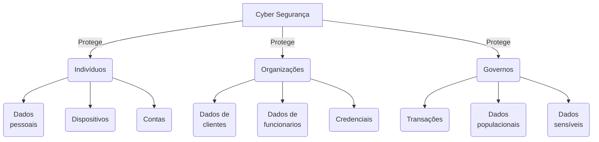

# Cyber Security

# O que é Cyber Segurança?

A **Cyber Segurança**, ou **Segurança Cibernética**, é um esforço contínuo para proteger **indivíduos**, **organizações** e **governos** contra ataques cibernéticos e danos que podem ser causados por pessoas mal intencionadas.

Como foi dito anteriormente, a Cyber Segurança tem como vertente de proteção três tipos de focos, sendo eles:

- Indivíduos
- Organizações
- Governos

Dessa forma, vamos adentrar um pouco em cada um desses níveis, esclarecendo e adentrando em alguns conceitos importantes dentro desse vasto mundo da segurança.

### **Proteção Individual**

O primeiro nível é a **Proteção Individual**, onde protegemos, defendemos e cuidamos dos nossos [dados pessoais](Cyber%20Security%201e1b7547491b806eaf75c9aaf877e5c9.md), que, de forma resumida, são todos os dados que nos identificam de alguma forma, seja nossa **identidade real** quanto nossa **identidade online,** conceitos que abordaremos mais a frente.

Nesse nível buscamos proteger:

- Dados Pessoais
    - Senhas
    - Credenciais
    - Contas
        - Sociais
        - Bancarias
- Dados e Dispositivos
    - Celulares
    - Tablets
    - Computadores

### Proteção organizacional

Dentro do nível de **Proteção Organizacional**, a responsabilidade de **proteger** e **defender** os dados passa a ser **não somente de um único indivíduo** mas de **todos os membros da organização**, destacando a importância de **treinamentos** e **capacitações** a respeito da **proteção de dados**, tanto **individuais dos membros da organização**, quando da **organização como um todo**.

Nesse nível buscamos proteger:

- Dados individuais dos membros da organização
    - Nome
    - Emails
    - Senhas
    - Credenciais
- Dados pessoais dos clientes
    - Nome
    - Idade
    - Email
    - Sexo
    - Credenciais
- Dados relacionados a organização
    - Historico de compras
    - Receitas
    - Despesas
    - Contas
    - Credenciais

### Proteção Governamental

Partindo para o terceiro nível temos a **Proteção Governamental**, onde a Cyber Segurança se torna algo mais do que importante, algo vital, até porque é por meio do governo que diversos tipos de **dados sensiveis** circulam, desde **endereços residenciais** a até mesmo dados relacionados a economia nacional.

Nesse nível buscamos proteger:

- Dados relacionados a estabilidade econômica
- Dados pessoais da população
- Dados governamentais

Por estarmos falando de uma proteção a nível de **Governo** é necessário **toda a caltela** ao lidar com qualquer questão que englobe esse nível de proteção.

---

---

# Dados Pessoais

Quando falamos sobre **dados pessoais** precisamos, antes de tudo, entender **o que são eles:**

- Dados pessoais são os **dados** que, em **conjunto ou não** com outros dados pessoais, revelam sua identidade.
    - Nome
    - CPF
    - RG
    - Idade
    - Telefone

Como é de se imaginar, como estamos falando de dados que revelam nossa identidade, podemos afirmar com toda certeza que esses dados são os principais alvos de criminosos, que quando em posse desses dados, podem cometer diversos tipos de crimes, utilizando nossa identidade:

- Roubo a contas bancárias
- Estelionato contra familiares
- Roubo de identidade
    - Em posse desses dados, os criminosos podem se passar pela vítima, podendo cometer crimes e realizar ações em nome da vítima.
        - Estelionato contra familiares

*De que forma esses criminosos conseguem essas informações?*

Isso é algo que intriga muitas pessoas mas, de forma simples e clara, normalmente essas informções são descobertas por meio de 

- **Engenharia Social**
    - Técnica que utiliza a psicologia e o comportamento humano como arma para manipular outras pessoas, de forma com que elas realizem ações para o atacante ou simplesmente forneçam algum tipo de informação.
- **Pesquisas em fontes de inteligencia aberta (OSINT)**
- **Vazamentos de Dados**
- **Hacking**

*Onde criminosos conseguem acessar minhas informações?*

Esses criminosos utilizam diversos meios e ferramentas para em fim conseguirem acessar esses dados:

### Registros Médicos

Todas as vezes que vamos ao médico ou a alguma consulta, nossos dados médicos são armazenados em um Registro Eletronico de Saúde (EHRs) de forma online.

Pensando nisso, devemos ter cuidado com os dados médicos que compartilhamos nas redes sociais, como atestados e laudos.

### Registros Escolares

Registros escolares contém informações cruciais de como fomos na escola, nossas qualificações, conquistas, ocorrências e relatórios comportamentais.

Com isso, nosso **contato** e outros dados pessoais podem estar expostos nesses registros academicos (IEPs).

### Registros de Emprego & Finanças

Os registros de emprego podem ser valiosos para os hackers, caso consigam coletar informações sobre seu emprego anterior ou até mesmo suas avaliações de desempenho atuais.

Seus registros financeiros podem incluir informações sobre **receitas** e **despesas**. Seus registros fiscais podem incluir **contracheques**, **extratos de cartão de crédito**, sua **classificação de crédito** e **detalhes de sua conta bancária**. Todos esses dados, se não forem protegidos adequadamente, podem comprometer sua privacidade e permitir que os criminosos digitais usem suas informações para seu próprio benefício.

---

# Protegendo nossos Dados Pessoais

Como já falamos anteriormente, **dados pessoais são todos os dados que juntos, ou separados, podem nos identificar como pessoa**, desde nosso nome, até nosso CPF, sendo caracterizados dentro de duas formas:

- **Identidade Offline**
- **Identidade Online**

Mas qual a diferença entre a **identidade offline** e a **identidade online** ?

### Identidade Offline

Nossa identidade **offline**, ou nossa **identidade real**, é aquilo que realmente somos, ou seja, nossas manias, características, personalidade entre outras coisas que no identifica como pessoa.

É importante não tratarmos esses dados como **irrelevantes** pois é bem capaz de invasores conseguirem roubar sua identidade e se passar por você sem que você perceba. 

> Nome completo, idade, CPF, RG e endereço também se encaixam nessa **identidade**
> 

E para isso, esses invasores utilizam ferramentas e técnicas onde não se faz necessário invadir seu computador ou celular, analisando suas informações e dados “*irrelevantes*” que você deixa a mostra na internet.

> OSINT & Engenharia Social são exemplos dessas técnicas
> 

### Identidade Online

De forma similar a nossa **identidade offline**, a **identidade online** é aquilo que nos identifica na internet, como nossos **apelidos** e **nomes** que utilizamos nas redes sociais e na internet.

E é aqui que devemos ter cuidado com o que expomos para que os outros vejam, pois da mesma forma que é possível roubar a **identidade offline** de uma pessoa, é ainda mais fácil roubar sua identidade online.

> Nicknames, emails, telefone e redes sociais se encaixam nessa **identidade**
> 

> *if you use the web you have an online identify*
> 

---

# Dispositivos Inteligentes

Vivemos em uma era onde tudo a nosso respeito está conectado e intrelassado a uma enorme rede de computadores e essa quantidade massiva e enorme de informações está se tornando cada vez mais de fácil acesso para os usuários finais. Por exemplo, hoje em dia é mais comum pagarmos uma conta ou consultar nosso extrato através dos nossos celulares, e da mesma forma que buscamos e acessamos informações dentro desses sites e aplicativos, eles produzem e enviam dados a nosso respeito.

Outros dispositivos e tecnologias que geram informações a nosso respeito são os dipositivos vestíveis, como os Smart Watches e Smart Rings. 

Essa mostragem de informações esse fácil acesso a elas podem até parecer gratuitos, mas não seria nossa privacidade o preço por isso?

# O que os Hackers querem?

Essa resposta parece meio óbvia né? Eles querem seu dinheiro e/ou sua identidade.

Com todas essas informações que estão disponíveis online, eles conseguem utilizar de alguma artimanhas para roubar seus dados e utilizá-los para invadir sua conta bancária, seu plano de saúde entre vários outras coisas.

# Quem mais quer meus dados?

Como é de se imaginar, não são apenas os Hackers que utilizam e que querem seus dados, serviços como os **Provedores de Internet**, **Anunciantes**, **Serviços de busca** & **Redes Sociais** e **Sites** também utilizam nossos dados diariamente, obtendo assim, uma persona mais fiel aos seus usuários.

---

# Dados Organizacionais

Em algumas organizações, existem dois tipos principais de dados:

## Dados Tradicionais

São, normalmente, gerados e mantidos pelas próprias organizações, sendo

### Dados transacionais

Dados relacionados a compras e vendas, atividades relacionadas as transações da organização

### Propriedade Intelectual

São as patentes, marcas registradas, planos de novos produtos. Isso tudo permite que uma empresa obtenha uma vantagem economica em relação a seus concorrentes. Essas informações são, geralmene, consideradas como segredos comerciais, e sua perda pode ser algo desastroso para essa organização

### Dados Financeiros

São os dados relacionados as finanças da organização, como por exemplo, declarações de rendimentos, balanços e demonstrações de fluxo de caixa, proporcionando um panorama sobre a saúde da organização

## I.O.T & Big Data

IOT são todos os dispositivos inteligentes que se conectam a rede e enviam e recebem dados, dentro dos IOT entram diversos dispositivos, como sensores, softwares e outros equipamentos. Dentro de uma organização podemos ter diversos IOT’s, como cameras e detectores de presença, que juntos enviam e recebem uma grande quantidade de informações, são tantos dados que surgiu a necessidade de termos um banco de dados que conseguisse suportar essa quantidade de dados, o famoso *Big Data**.*** 

---

# Métodos de Infiltração

Nessa seção falaremos sobre as principais formas que os **invasores** utilizam para conseguirem se **infiltrar** dentro de **sistemas** ou **redes**.

## Engenharia Social:

A manipulação de pessoas em troca de informações ou de favores → “Preciso que você faça tal coisa…”

| Pretexto  | Seguir | Troca |
| --- | --- | --- |
| Quando utilizamos de determinado pretexto para conseguirmos uma informação | Quando queremos ter acesso a algum lugar e começamos a seguir uma pessoa que tem acesso a ele | Quando é feito uma troca com outra pessoa, a informação por algo que essa pessoa queira |
| Falar que precisa dos dados pessoas para confirmar a identidade da pessoa | Quando fazemos isso devemos tomar algumas medidas e não ficar somente seguindo essa pessoa, boas práticas envolvem puxar assunto, deixando a pessoa confortável a ponto de confiar em deixar você entrar com ela | Uma informação em troca de algo, como outra informação por exemplo, ou até mesmo dinheiro |

A engenharia social é muito utilizada para a obtenção de informações, não só em um contexto face a face, mas também por meio das redes sociais, onde é possível ter contato com várias pessoas, além de podermos criar [*socket puppets*](OSINT%201e2b7547491b807f838cc199b4120ef7.md), ou seja, disfarces, para nos mantermos mais seguros e nos adaptarmos a pessoa que queremos “atacar”.

## Denial Of Service (DoS)

Um tipo de ataque que visa redes de computadores. Esse é um ataque relativamente fácil de realizar, o que aumenta seu nível de estragos, indo de uma simples interrupção de minutos, até mesmo algo mais grave, que pode levar horas ou até mesmo dias para se estabilizar novamente.

| Grande quantidade de tráfego | Pacotes de dados maliciosos |
| --- | --- |
| Ocorre quando é enviado a rede, ao host ou a aplicação uma quantidade de dados tão grande que o servidor em questão não consegue suportar, fazendo com que ele fique lento ou caia | Como sabemos, um pacote é uma determinada quantidade de dados, e quando falamos de um pacote de dados maliciosos, queremos dizer que esse pacote está com algum tipo de erro, o que faz com que, quando enviado e carregado, cause uma lentidão ou um travamento. |

## Distributed Denial of Service (DDoS)

É um ataque similar ao DoS convencional, mas ao invés de partir de apenas uma máquina, ele é um DoS vindo de várias máquinas diferentes conectadas pela internet.
Por exemplo: Um hacker pode criar uma *botnet* com vários *zombies*, com esses zumbis constantemente fazendo uma varredura pela rede, procurando e infectando cada vez mais hosts, criando assim ainda mais *zombies*.

## Botnet

É uma rede de computadores *Bots* conectados através da internet, sendo controlada por uma pessoa ou por um grupo. Esses Bots geralmente são computadores ao redor do mundo que foram infectados de alguma forma, geralmente por meio de malwares, adquiridos de sites inseguros, links maliciosos de email ou de arquivos infectados.

Essas Botnets podem ser utilizadas das seguintes formas:

- Distribuição de malwares
- Ataques DDoS
- Spam de emails
- Brute force attacks

## On-Path attacks

Ataques que modificam ou interceptam a comunicação entre dois dispositivos, como por exemplo um navegador web e um servidor web, seja para coletar informações ou para até mesmo se passar por um desses dispositivos.

| Man in the MIddle (MitM) | Man in the Mobile (MitMo) |
| --- | --- |
| Ocorre quando o atacante consegue ter acesso ao dispositivo de um usuário sem que ele perceba, com isso, o hacker consegue interceptar mensagens antes mesmo delas seres enviadas.
Como por exemplo por meio de ataques e invasões de rede, que podem ocorrer por meio de um sniffer, como o wireshark. | De forma similar ao Man-in-the-middle, o Man-in-the-mobile foca no controle do celular do usuário, de forma que quando infectado, o celular do usuário começa a exfiltrar os dados sensíveis do usuário. |

## SEO Poisoning

O SEO é um método que possibilita que empresas consigam que suas páginas na web obtenham um bom ranking em relação as outras, de forma a fazer com que seu site seja um dos primeiros a serem recomendados em determinada pesquisa, fazendo com que eles ganhem visibilidade.

Bem, e como o SEO pode, e é, utilizado nesse contexto?
De forma simples e resumida, podemos dizes que ele é utilizado de forma semelhante ao seu uso convencional, mas, em sites mal intencionados, que contém malwares e vírus, fazendo com que esses sites fiquem em altos rankings.

E isso é o que chamamos de SEO Poisoning, que tem como principal objetivo gerar tráfego para sites maliciosos.

## Passwords attacks

São ataques que tem como objetivo obter a senha de determinado local, seja de uma conta, de um sistema, etc. Sendo que os mais comuns são:

- Password Spraying
- Dictionary Attacks
- Brute-force attacks
- Rainbow attacks
- Traffic interception (sniffing)

## Advanced Persistent Threads

É um tipo de ataque mais avançado que demanda mais tempo para ser realizado. Esse ataque consiste na utilização de ferramentas e técnicas avançadas, além de que **ataques persistentes avançados**, como o próprio nome já diz, é um ataque persistente, ou seja, é um ataque que utiliza de várias ferramentas, dias e dedicação do atacante. Por ser um ataque mais elaborado e que demanda mais tempo, ele geralmente é realizado contra e em grandes casos, como por exemplo, em ataques a governos e a nações.

O principal motivo por detrás desse tipo de ataque é, assim como os outros, destruir ou capturar informações sem ser detectado de forma alguma, utilizando malwares customizados uma ou mais vezes em um ou mais computadores ou servidores, além de continuar indetectável.

---

# Vulnerabilidades e Exploits

- Vulnerabilidade → Qualquer falha presente em um Software ou em um Hardware
- Exploit → Qualquer programa criado para tirar vantagem de alguma vulnerabilidade

Exploits são utilizados por hackers para tirar vantagem de vulnerabilidades, conseguindo assim invadir e coletar informações sigilosas de um sistema ou de uma fonte específica, seja ela qual for.

Dentro das vulnerabilidades temos duas vertentes: Vulnerabilidades de **Software** e Vulnerabilidades de **Hardware**

### Vulnerabilidades de Hardware

São as vulnerabilidades encontradas em hardwares, geralmente causadas por falhas no design dos mesmos. Por exemplo, a memória RAM é basicamente um amontoado de capacitores, que estão muito perto um do outro, com isso, descobriram que qualquer mudança em um desses capacitores poderia impactar diretamente outros que estavam próximos.

Baseado nessa **vulnerabilidade**, surgiu um **exploit** chamado **Rowhammer**. Ao acessar repetidamente uma determinada linha na memória, esse **exploit** causava interferências na memória, o que consequentemente **corrompia** os dados armazenados naquela memória ram.

### Meltdown

- Side-channel attack

Vulnerabilidade que permite ler todo o conteúdo de uma memória de um determinado sistema

### Espectre

- Side-channel attack

Vulnerabilidade que permite ler todo o conteúdo da memória de qualquer aplicação

## Vulnerabilidades de software

Esse tipo de vulnerabilidade é encontrada dentro de softwares e aplicativos, geralmente dentro de sistemas operacionais ou no código fonte das aplicações. Um exemplo disso é o **SYNfun Knock.**

## Categorizando Vulnerabilidades de Softwares

- Buffer Overflow
- Non-Validated input
- Race conditions
- Weaknesses in security pratices
- Access control problens

---

# Protegendo Dispositivos e a Rede

Como sabemos, nossos dispositivos são como portais para nossa vida digital, e por conta disso devemos proteger e tomar o máximo de cuidado com eles, garantindo assim nossa privacidade e em outros casos a privacidade da empresa. E para fazer essa proteção existem alguns métodos:

- Configurar um Firewall
- Utilizar um Antivírus e um Antispyware
- Gerenciar o Sistema Operacional e o Navegador
- Configurar um Gerenciador de Senha

### Problemas relacionados a IOT’s

Quando falamos de segurança digital, um ponto que não podemos deixar de falar é sobre como os IOT’s podem apresentar um risco ainda maior a sua segurando quando comparado a computadores e a celulares. Diferentemente dos computadores e dos celulares que tem seus sistemas atualizados frequentemente, os dispositivos IOT continuam, em sua maioria, sempre com os softwares originais de fábrica, sem serem atualizados posteriormente, o que a primeira vista não parece significar muita coisa na realidade pode ser representar um grande perigo a sua rede interna.

Isso ocorre principalmente pela falta de atualizações para a maioria desses dispositivos, ou seja, caso uma vulnerabilidade seja encontrada para esse software, sua segurança pode estar comprometida, o que se agrava quando lembramos que mais de 98% desses dispositivos estão ligados a nossa rede pessoal de internet, o que pode facilitar o roubo de dados, como contas e etc, o que pode se agravar quando falamos em um contexto organizacional.

Uma maneira de se proteger ao utilizar esses dispositivos é utilizar uma rede específica para eles, isolando-os da nossa rede principal.

Uma ferramenta que nos mostra na prática esses riscos é o **shodan**, mais conhecido como google para hackers, que nos mostra IOT’s vulneráveis, como câmeras.

# Segurança de Redes Domésticas